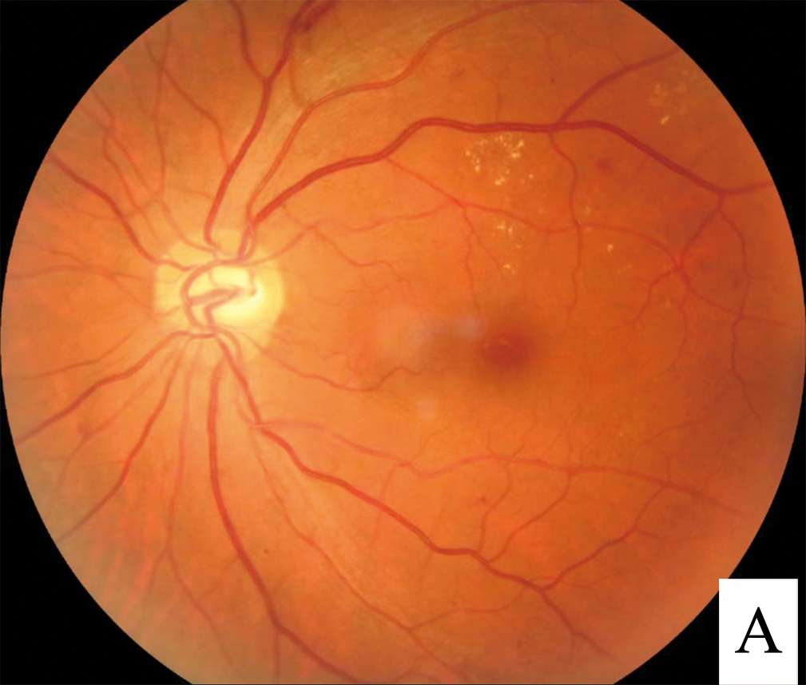
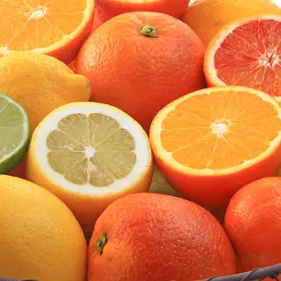
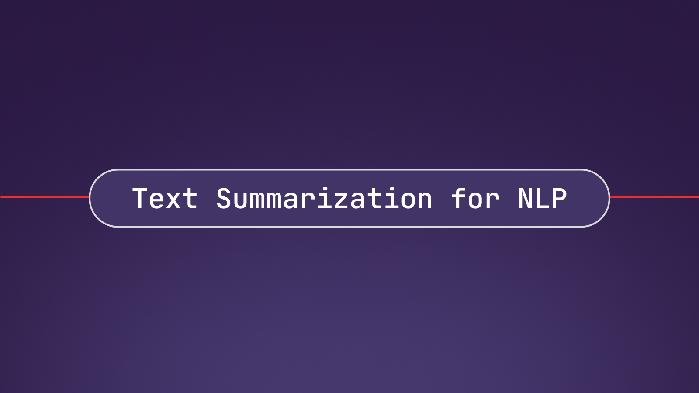
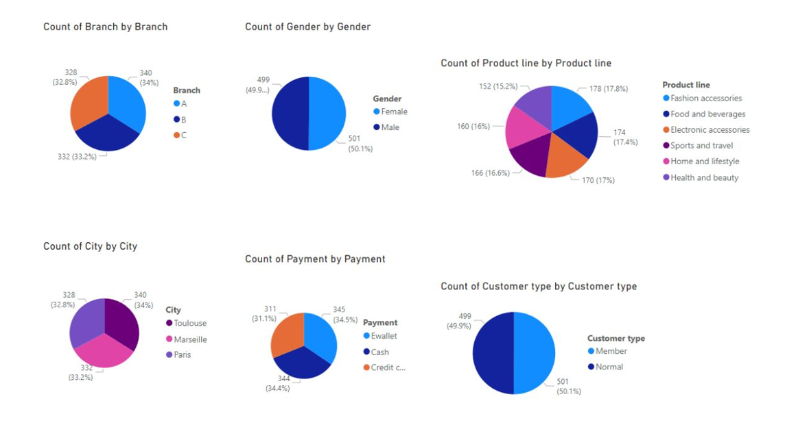
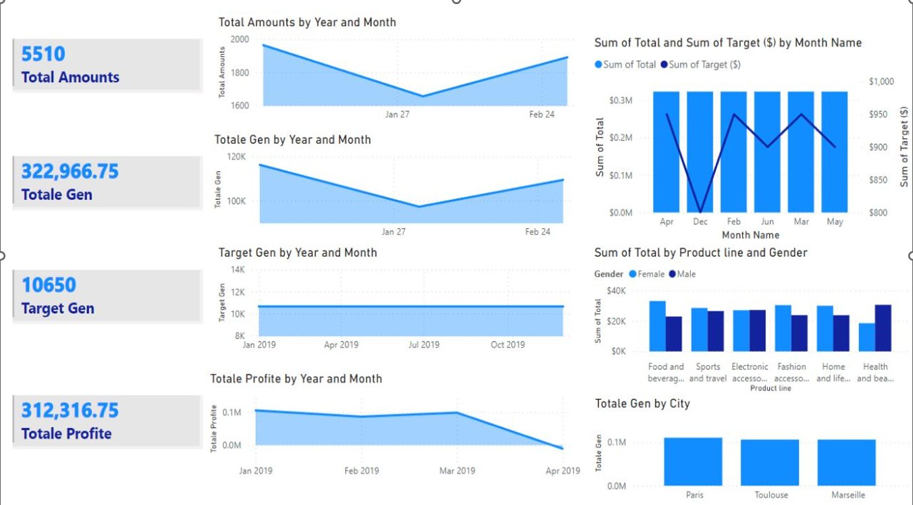
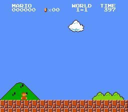

# Data Scientist

This portfolio serves as a comprehensive collection of some of my Data Science and Data Analysis projects undertaken for academic, self-learning, and hobbyist endeavors. Additionally, it encompasses my skills, and certificates. Regular updates are made to ensure its relevance.

If interested in my profile, contact me using :
- [Email](assiaer123@gmail.com)
- [LinkedIn](https://www.linkedin.com/in/assia-erguigue-a0b92518a/?originalSubdomain=ma)

#### Technical Skills: 
- Python: sklearn, tensorflow,cv2,pandas, numpy, matplotlib,matplotly, scipy...
- Power BI
- SQL
- NoSQL : MongoDB/RethinkDB/ Neo4j/Cassandra
- Docker 
- Microsoft azure 
- Django

#### Skills
- Machine Learning
- Deep Learning
- Natural Language Processing
- Text Mining
- Business Intelligence
- Cloud Computing
- Big Data
- Data Analysis & Visualization
- Data Modeling

## Education
- Knowledge and data science ENGINEERING (2021 - 2024: Ongoing) | School of Information Sciences(ESI) - Rabat
- Classes préparatoires MPSI | Lycée Selmane El Farissi - Salé

## Work Experience
**INTERNSHIP of application REDAL operated by VEOLIA  (_08/08/2023 - 08/09/2023_)** at the Information Systems Department
- Development of a stock management application.
- Creation of a full-stack web application using the DJANGO framework for stock management.

**INTERNSHIP of discovery REDAL operated by VEOLIA  (_01/07/2023 - 01/08/2023_)**
- Service Discovery
- Handling internal software and responding to complaints.

## Certificats: 
- Building Intelligent Virtual Agents with IBM Watson Assistant
- HarvardX: CS50's Introduction to AI with Python.(ongoing)
- HarvardX: CS50's Introduction to Databases with SQL.(ongoing)

## Languages: 
- Anglais: 7.5-C1 IELTS
- French: B2
- Arabic: Native

## Conception methods: 
- UML
- MERISE

## Work methods: 
- SCRUM(Agile)
- ML/Ops: Machine Learning Operations
- CI/CD: Continuous Deployment 

## Projects:
For more projects check my [github](https://github.com/AssiaERGUIGUE)

###  Segmentation of medical images for diabetic retinopathy:

Contrast enhancement, histogram equalization, noise elimination, and analysis segmentation. 

[Publication](https://github.com/AssiaERGUIGUE/diabetic-retinopathy-segmentation)

###  Integrated Pest Management through Data-Driven Classification of Farm Insects, with Emphasis on Orange Canker Culprits: CNN, transfer learning...

[Publication](https://github.com/AssiaERGUIGUE/citrus-disease-classification-and-citrus-canker-detection)

---

###  Development of an application for text summarization:

[Publication](https://github.com/AssiaERGUIGUE/summary-app)
Text mining and sentiment analysis using RNNs (T5, BART...).

---

###  Performance analysis using Power BI and Python
[Publication](https://github.com/AssiaERGUIGUE/performance-analysis)

---

### Mario AI player: Reinforcement Learning
[Publication](https://github.com/AssiaERGUIGUE/Mario-AI-player)

This project was mainly made to familiarize with the concept of reinforcement learning as well as getting started with the gym framework and its environments such as Mariobros-V0

---

###  Bayesian classification and clustering project on the "Wisconsin breast cancer dataset" on Kaggle using Python.

[Publication](https://github.com/AssiaERGUIGUE/Classification-SVM-breast-cancer)

---

###  Preparation of a workshop on Bayesian machine learning.

---

###  Creation of a predictive model:

[Publication](https://github.com/AssiaERGUIGUE/HR-regression)

Salaries based on employees data such as  on Kaggle.

---

###  Création d’une solution cloud E-social pour la gestion des factures deployé sur google cloud

